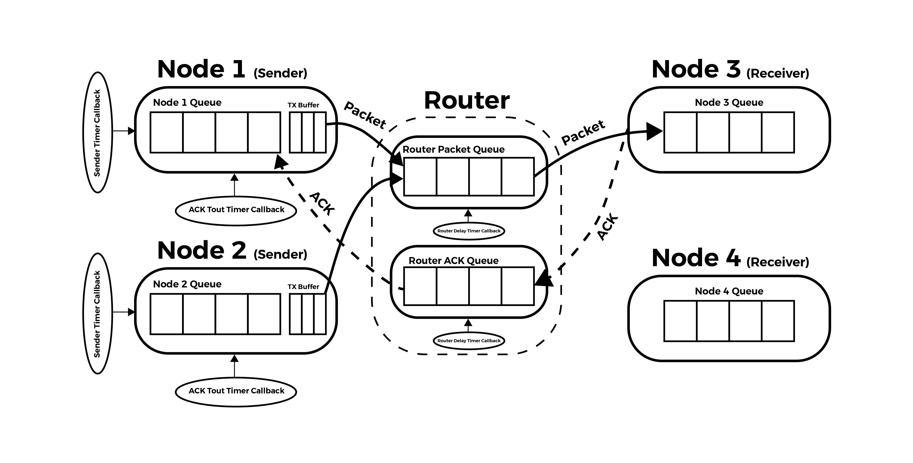
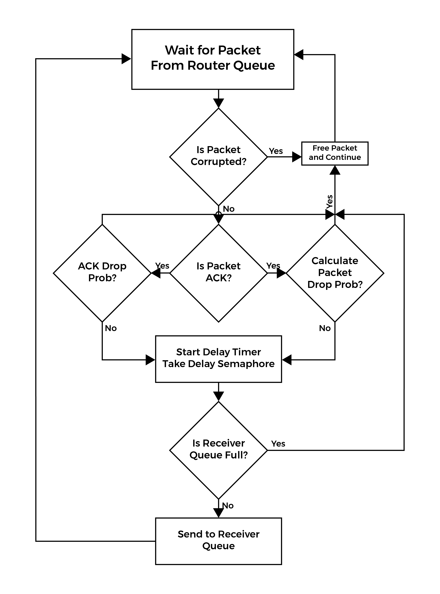
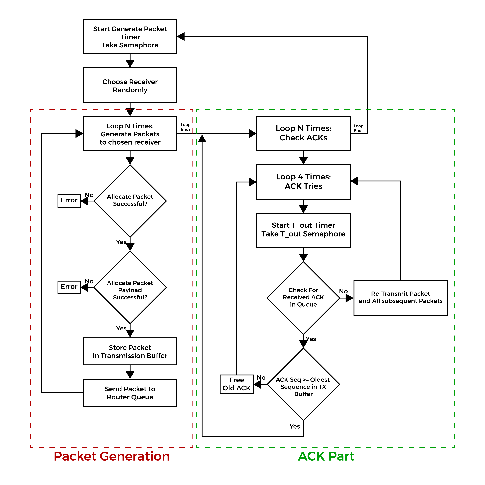
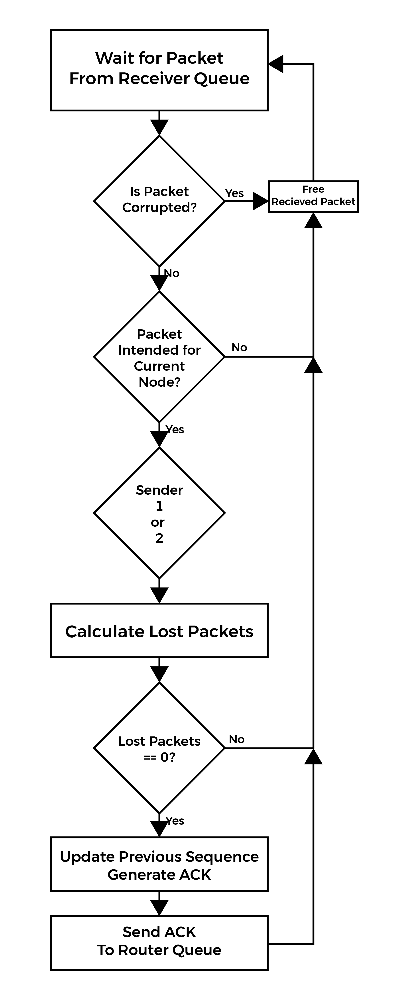

# FreeRTOS Network Switch Simulator

A Simple network switch developed using FreeRTOS on an STM32f4x Target Board through QEMU on Eclipse CDT.

>[!NOTE]
> This Project is made under the supervision of Dr. [Khaled Fouad](https://kelsayed.github.io/) as part of our Embedded Systems Course (ELC2080) as taught at the Faculty of Engineering Cairo University, Department of Electric, Electronics and Communications Engineering.

Developed by:

## **System Design**

 System Diagram 

### **Network Simulation Components:**

---

#### **Sender Nodes**
- Two sender nodes generate packets at a **random interval between [100, 200] ms**.
- Each packet is sent to a random receiver node (either Node 3 or 4).
- Packets are tagged with a **sequential number** per receiving node.
- Packets are:
  1. **Sent to the router queue**
  2. **Stored in a local buffer** awaiting an ACK
- If the **ACK is delayed longer than Tout**, the sender resends packets starting from the first unacknowledged one.
- This retransmission occurs **up to 4 times**, after which the buffer is cleared, and the sender continues with new packets.

#### **Receiver Nodes**
- Two receiver nodes check:
  - If the packet is addressed to them
  - The sequence number to detect lost packets
- An **ACK is only sent** if **no packets are lost**, notifying the sender of successful delivery.

#### **Router (Switch) Node**
- The router:
  - Handles packet forwarding via a **single queue (FIFO)**
  - Has a probability:
    - `Pdrop` to **drop packets**
    - `P_ACK` to **drop ACKs**
- Each packet transmission includes a **delay** calculated as:  
  `D + (L * 8 / C)`  
  Where:
  - `D` = constant propagation delay  
  - `L` = packet length  
  - `C` = constant link capacity

#### **Timer Callbacks**
- Timers simulate each delay/period using **semaphores** for task signaling:
  - A task starts a timer and waits (blocked) by trying to take a taken semaphore.
  - When the timer expires, its **callback releases the semaphore**, unblocking the task.

#### **Packets**
- Packets are **dynamically allocated** with structures supporting variable-length payloads.
- ACK packets follow the same structure but have a fixed, shorter length of **40 bytes**.
- See:
  - **Figure 2** for packet structure  
  - **Code Snippet 1** for implementation

#### **Mutual Exclusion**
- A **`GeneratePacket` semaphore** is used to ensure **thread-safe memory allocation and deallocation**, avoiding corruption during packet handling.  
  - See **Code Snippet 2** for details.

#### **Random Process**
- Randomness is used throughout the system for:
  - Packet timing
  - Routing decisions
  - Drop probabilities
- Implemented with `rand()` from `stdlib.h`, seeded via `srand(time(NULL))` to ensure unique results on each run.

## **Task Flow-Charts:**

 Router Flow-Chart     

 Sender Flow-Chart     

 Receiver Flow-Chart    

